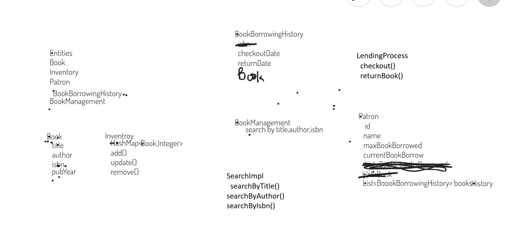

# 📚 Library Management System

This project is designed to help librarians manage books, patrons, and lending processes efficiently using a console-based Java application built on Object-Oriented Programming principles.

---

## 🚀 Getting Started

### 🛠️ Requirements
- Java JDK 8 or above
- Any Java IDE (e.g., IntelliJ, Eclipse) or terminal access

### ▶️ How to Run

1. Clone the repository or download the source code.
2. Open the project in your Java IDE or navigate to the directory via terminal.
3. Compile and run the main class:

```bash
javac BookManagement.java
java BookManagement
````

---

## 🧩 Features

* `addBook()` – Add new books to the system
* `removeBook()` – Remove books from the system
* `updateBook()` – Update book details
* `checkout()` – Issue a book to a patron
* `returnBook()` – Return a borrowed book
* `searchByTitle()` – Search books by title
* `searchByAuthor()` – Search books by author
* `searchByIsbn()` – Search books by ISBN

---

## 🖼️ Class Diagram



> *Note: Make sure the image file `LMS_ClassDiagram.png` is placed inside a folder named `assets` in your project directory. Update the path if necessary.*

---

## 👨‍💻 Authors

* Gaurav Singhal
* Saumitra Pal

---

## ⚖️ License

This project is not currently licensed.

```
